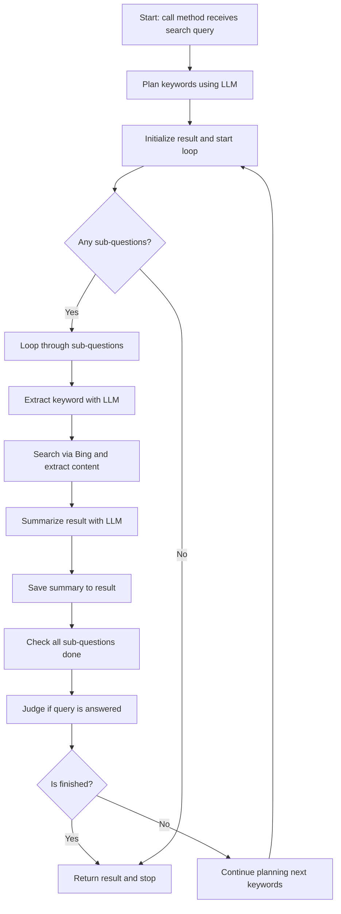

# Agentic-DeepSearch

A comprehensive web research tool that combines Bing search with OpenAI's LLMs to perform deep, iterative research on complex queries.

## Features

- Bing web search integration
- OpenAI GPT-powered query planning and result analysis
- Iterative research with multiple passes
- MCP server integration for tool exposure
- Concurrent processing of search results

## Architecture



## Installation

1. Clone the repository:
```bash
git clone https://github.com/zhangaimin/Agentic-DeepSearch.git
cd Agentic-DeepSearch
```

2. Install dependencies:
```bash
pip install -r requirements.txt
```

3. Set up environment variables:
```bash
export OpenAI_API_KEY="your_openai_key"
export Bing_API_KEY="your_bing_key"
```

## Usage

### As a Python module

```python
from deepsearch import WebSearchTool, DeepResearchParams
import asyncio

async def main():
    tool = WebSearchTool()
    results = await tool(DeepResearchParams(searchQuery="Your research question"))
    print(results)

asyncio.run(main())
```

### Via MCP Server

Start the MCP server:
```bash
python deepsearch_mcp.py
```

## Configuration

Required environment variables:
- `OpenAI_API_KEY`: Your OpenAI API key
- `Bing_API_KEY`: Your Bing Search API key

Optional configuration:
- Edit `prompts.py` to modify the LLM prompts
- Adjust `max_iterations` in `deepsearch.py` to control research depth

## API Documentation

### WebSearchTool

Main research class with methods:
- `web_search_bing(query, page_num=3)`: Perform Bing search
- `extract_url_content(url)`: Get text content from URL
- `reranker_by_gpt(user_question, search_title)`: Rank results by relevance [can be replace with bge reranker model]
- `search_by_bing(searchKeyWords, searchQuestion)`: Full search pipeline
- `__call__(params)`: Main research interface

### MCP Endpoints

- `web_deep_search(query)`: Perform comprehensive research
- `content://{url}`: Get web page content

## Contributing

1. Fork the repository
2. Create your feature branch
3. Commit your changes
4. Push to the branch
5. Create a new Pull Request

## License

MIT
